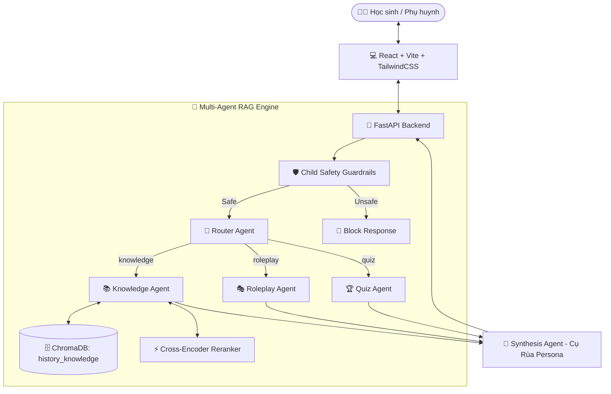

# 🐢 Đại Việt Kids AI — Trợ Lý AI Lịch Sử & Địa Lý Tiểu Học

> **Hệ thống Chatbot AI (Agentic RAG) chuyên biệt cho học sinh Lớp 4 & Lớp 5 với hình tượng "Cụ Rùa Thông Thái", tích hợp bộ lọc an toàn cho trẻ em (Child Safety Guardrails) và kiến trúc đa tác tử (Multi-Agent Architecture).**

---

## 🌟 1. Giới Thiệu Dự Án

**Đại Việt Kids AI** là nền tảng RAG tương tác học tập lịch sử và địa lý dành cho học sinh tiểu học (Lớp 4 & Lớp 5 theo Chương trình Sách Giáo Khoa Bộ GD&ĐT).

### 🎯 Điểm Nổi Bật:
1. **Persona "Cụ Rùa Thông Thái":** Giọng văn ấm áp, đôn hậu, xưng hô *"Cụ Rùa - cháu"*, luôn kể chuyện sinh động, kết thúc bằng câu hỏi gợi mở để kích thích trí tò mò của trẻ.
2. **Kiến Trúc Đa Tác Tử (Multi-Agent RAG):**
   - **Knowledge Agent:** Tra cứu chính xác kiến thức lịch sử từ Sách Giáo Khoa được lưu trữ trong Vector Database (ChromaDB).
   - **Roleplay Agent:** Cho phép học sinh trò chuyện trực tiếp (nhập vai) với các nhân vật lịch sử như Vua Hùng, Hai Bà Trưng, Ngô Quyền, Trần Hưng Đạo...
   - **Quiz Agent:** Tự động tạo câu hỏi trắc nghiệm đố vui, kiểm tra ghi nhớ với lời chúc mừng sinh động.
3. **Lớp Bảo Vệ An Toàn (Child Safety Guardrails):** Lọc chặn tuyệt đối các từ khóa thô tục, bạo lực dã man, từ ngữ nhạy cảm hoặc tư tưởng không phù hợp với lứa tuổi tiểu học, tự động hướng trẻ về chủ đề học tập.
4. **Giao Diện Sân Chơi Lịch Sử (Lumos History Playground):**
   - **TimelineBar:** Thanh dòng thời gian lịch sử tương tác từ Thời Hùng Vương đến Hào khí Đông A nhà Trần.
   - **MascotWidget:** Cụ Rùa phản ứng cảm xúc theo thời gian thực (vui mừng, suy ngẫm, hào hứng).
   - **HistoryCard:** Thẻ bài kiến thức Flashcard lật 3D trực quan.
   - **QuizWidget:** Khung làm bài trắc nghiệm kèm chấm điểm và giải thích chi tiết.

---

## 🏗️ 2. Kiến Trúc Hệ Thống



---

## 📁 3. Cấu Trúc Thư Mục Dự Án

```text
rag-history/
├── backend/
│   ├── app/
│   │   ├── api/
│   │   │   ├── rag_router.py       # API Endpoint RAG trả về metadata (quiz_data, character_played)
│   │   │   ├── router.py           # API Router chính (đã loại bỏ weather/gis cũ)
│   │   │   └── ...
│   │   ├── rag/
│   │   │   ├── agents/
│   │   │   │   ├── router.py       # Định tuyến query (knowledge, roleplay, quiz)
│   │   │   │   ├── knowledge_agent.py # Xử lý truy vấn SGK Lịch sử
│   │   │   │   ├── roleplay_agent.py  # Xử lý nhập vai nhân vật lịch sử
│   │   │   │   ├── quiz_agent.py      # Xử lý đố vui trắc nghiệm
│   │   │   │   └── synthesis_agent.py # Master orchestrator & Cụ Rùa Persona
│   │   │   ├── guardrails.py       # Lớp lọc từ khóa & nội dung an toàn cho trẻ em
│   │   │   ├── ingestion/
│   │   │   │   └── vector_store.py # ChromaManager (collection: history_knowledge + Offline Fallback)
│   │   │   └── retrieval/
│   │   │       └── reranker.py     # Cross-Encoder Reranker
│   └── tests/                      # Bộ kiểm thử tự động pytest
├── frontend/
│   ├── src/
│   │   ├── components/
│   │   │   ├── TimelineBar.tsx     # Thanh dòng thời gian lịch sử tương tác
│   │   │   ├── MascotWidget.tsx    # Cụ Rùa Thông Thái & bong bóng thoại
│   │   │   ├── HistoryCard.tsx     # Thẻ bài Flashcard lật 3D
│   │   │   ├── QuizWidget.tsx      # Khung đố vui trắc nghiệm
│   │   │   ├── Dashboard.tsx       # Sân chơi Lịch sử (Lumos History Playground)
│   │   │   └── TerraBotWidget.tsx  # Khung chat Cụ Rùa (HistoryChatWidget)
│   │   └── App.tsx                 # Cấu hình định tuyến & Navbar mới
├── markdowns/                      # Dữ liệu nguồn SGK Lịch sử Lớp 4 & 5
└── docker-compose.yml              # Triển khai toàn bộ hệ thống bằng Docker
```

---

## 🚀 4. Hướng Dẫn Cài Đặt & Triển Khai (Deployment Guide)

Chi tiết toàn bộ quy trình, kiến trúc, sao lưu và xử lý sự cố có tại: **[Tài liệu Hướng dẫn Triển khai Chi tiết](file:///home/mypc/rag-history/docs/DEPLOYMENT_GUIDE.md)**.

### Cách 1: Chạy Môi Trường Phát Triển Cục Bộ (Local Development với Hot-Reload)
Dành cho lập trình viên phát triển tính năng, sửa code phản hồi ngay lập tức (HMR):
```bash
# 1. Khởi tạo file môi trường
cp .env.local.example backend/.env

# 2. Khởi động hệ thống Local
docker compose -f docker-compose.local.yml up --build -d

# 3. Truy cập ứng dụng
# - Frontend (Vite HMR): http://localhost:3000
# - Backend API Docs: http://localhost:8000/docs
```

### Cách 2: Triển Khai Máy Chủ Production (Production Deploy)
Dành cho môi trường triển khai thực tế trên server, tối ưu Nginx tĩnh, healthcheck, và restart policies:
```bash
# 1. Cấu hình biến môi trường production
cp .env.prod.example backend/.env

# 2. Khởi động 5 microservices production
docker compose -f docker-compose.prod.yml up --build -d

# 3. Kiểm tra trạng thái sức khỏe
docker compose -f docker-compose.prod.yml ps
# Truy cập: http://localhost (Port 80)
```

### Cách 3: Chạy Native không dùng Docker (Python & Node.js)
```bash
# Backend
cd backend
python3 -m venv venv && source venv/bin/activate
pip install -r requirements.txt
uvicorn app.main:app --host 0.0.0.0 --port 8000 --reload

# Frontend (terminal khác)
cd frontend
npm install
npm run dev
# Truy cập: http://localhost:3000
```

---

## 🧪 5. Kiểm Thử Tự Động (Automated Testing)

Hệ thống được trang bị bộ test tự động với pytest, hỗ trợ cả chế độ **Offline Fallback** (không cần kết nối API OpenAI/Gemini hay Embedding server vẫn test thành công):

```bash
cd backend
pytest -v
```

**Các mục kiểm thử trọng tâm:**
- `test_api.py`: Kiểm thử endpoint `/chat`, luồng RAG và phản hồi chặn từ khóa của Guardrail.
- `test_agents.py`: Kiểm thử logic phân loại của `RouterAgent`, bộ lọc `ChildSafetyGuardrail` và `SynthesisAgent`.
- `test_vector_store.py`: Kiểm thử lưu trữ và tra cứu ngữ nghĩa trên ChromaDB (`history_knowledge`).
- `test_reranker.py`: Kiểm thử thuật toán sắp xếp lại ngữ cảnh Cross-Encoder.

---

## 📖 6. Hướng Dẫn Sử Dụng Cho Học Sinh & Phụ Huynh

1. **Khám phá Dòng thời gian:** Chạm vào từng mốc lịch sử trên thanh **TimelineBar** (Hùng Vương, Hai Bà Trưng, Bạch Đằng...) để chọn giai đoạn học tập.
2. **Lật thẻ bài Flashcard:** Nhấn vào thẻ bài ở cột bên trái để lật mặt sau xem "Ghi nhớ nhanh" các kiến thức trọng tâm SGK.
3. **Thử sức Đố vui:** Chọn đáp án A, B, C trong khung **Thử thách Của Cụ Rùa** để nhận lời chúc mừng và giải thích chi tiết.
4. **Trò chuyện cùng Cụ Rùa:** Nhấn vào biểu tượng 🐢 ở góc dưới bên phải để mở khung chat. Cháu có thể hỏi kiến thức, hoặc nói *"Cụ Rùa ơi hãy cho cháu nhập vai trò chuyện với Vua Hùng/Ngô Quyền"*!
