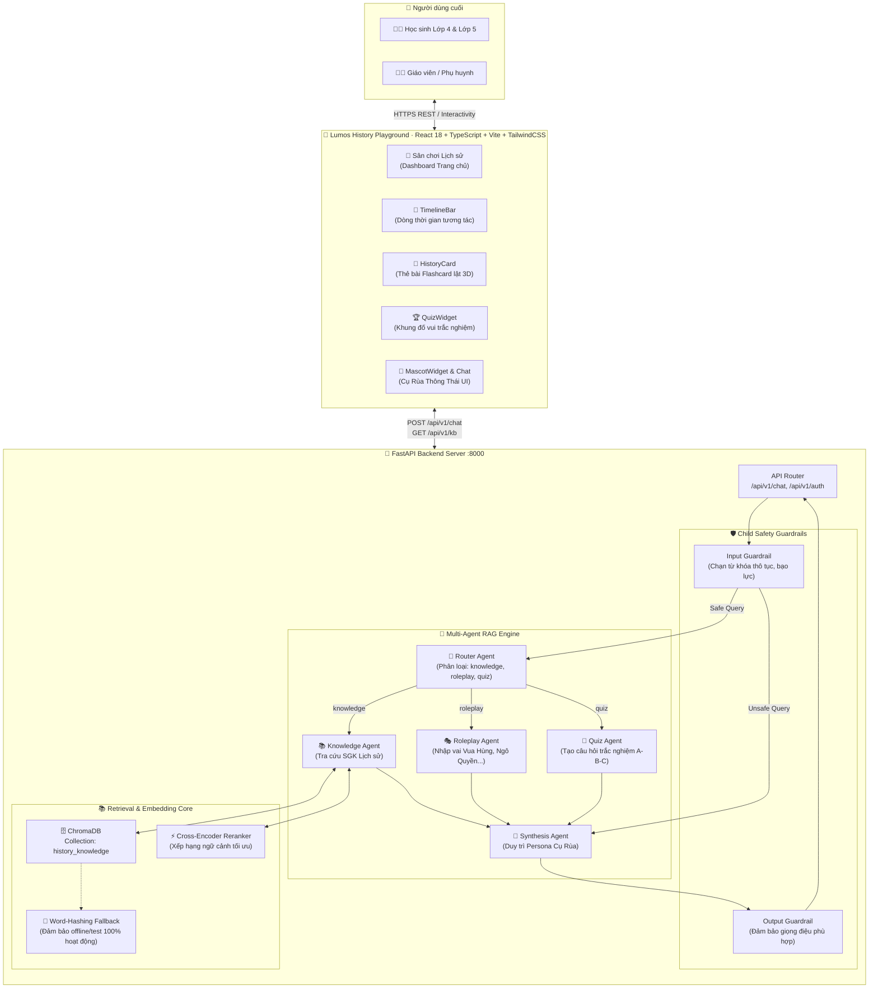
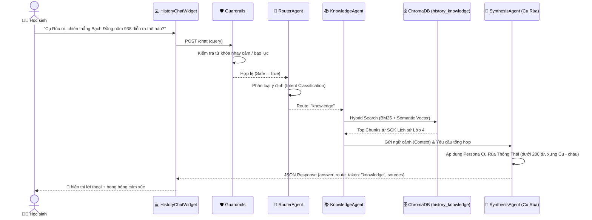

# 🏰 Lumos History Bot — Tài Liệu Kiến Trúc Hệ Thống (Multi-Agent RAG)
> **Phiên bản:** 3.0 · **Ngày:** 2026-07-05 · **Đề tài:** Trợ lý AI Lịch sử & Địa lý Tiểu học (Lớp 4 & Lớp 5)

---

## 1. Tổng Quan Kiến Trúc

**Lumos History Bot** là hệ thống trợ lý học tập AI chuyên biệt dành cho học sinh tiểu học (Lớp 4 & Lớp 5), ứng dụng kiến trúc **Multi-Agent RAG (Retrieval-Augmented Generation)** kết hợp với **Child Safety Guardrails (Lớp bảo vệ an toàn cho trẻ em)**. Hệ thống loại bỏ hoàn toàn các module xử lý thiên tai/GIS phức tạp trước đây để tập trung vào trải nghiệm tương tác trực quan, an toàn và hấp dẫn dưới hình tượng **"Cụ Rùa Thông Thái"**.

| Thuộc tính | Giá trị |
|---|---|
| **Mục tiêu cốt lõi** | Trợ lý học tập Lịch sử & Địa lý tiểu học chuẩn Sách Giáo Khoa (SGK) |
| **Persona AI** | **Cụ Rùa Thông Thái** (Đôn hậu, xưng Cụ Rùa - cháu/bạn nhỏ, gợi mở câu hỏi) |
| **Runtime** | Python 3.13+ (FastAPI Backend), Node.js 18+ (React 18 Frontend) |
| **Vector Database** | ChromaDB (Collection: `history_knowledge`) + Word-Hashing Offline Fallback |
| **AI Architecture** | Multi-Agent RAG (Router, Knowledge, Roleplay, Quiz, Synthesis) |
| **Bảo mật & An toàn** | Child Safety Guardrails (Lọc từ khóa bạo lực, nhạy cảm, định hướng học tập) |

---

## 2. Sơ Đồ Kiến Trúc Tổng Thể (System Architecture Overview)



---

## 3. Sơ Đồ Luồng Xử Lý Truy Vấn (Multi-Agent RAG Sequence)



---

## 4. Chi Tiết Các Tác Tử AI (Multi-Agent Specifications)

1. **Router Agent (`router.py`):**
   - Phân tích câu hỏi đầu vào của trẻ để định tuyến chính xác vào 1 trong 3 nhánh:
     - `knowledge`: Các câu hỏi hỏi về mốc thời gian, sự kiện, nhân vật, ý nghĩa lịch sử trong SGK.
     - `roleplay`: Các câu hỏi yêu cầu đóng vai, trò chuyện trực tiếp (ví dụ: *"Hãy đóng vai Trần Hưng Đạo"*, *"Cụ Rùa ơi cho cháu nói chuyện với Vua Hùng"*).
     - `quiz`: Yêu cầu thử thách, đố vui, kiểm tra bài cũ (ví dụ: *"Đố vui đi Cụ Rùa"*, *"Cho cháu câu hỏi trắc nghiệm"*).

2. **Knowledge Agent (`knowledge_agent.py`):**
   - Chuyên trách tra cứu dữ liệu từ Vector Store ChromaDB (`history_knowledge`).
   - Sử dụng Cross-Encoder Reranker để chọn ra 3 đoạn văn bản chính xác nhất từ sách giáo khoa làm ngữ cảnh cho LLM.

3. **Roleplay Agent (`roleplay_agent.py`):**
   - Hóa thân thành các vị anh hùng dân tộc (Vua Hùng, Hai Bà Trưng, Ngô Quyền, Đinh Bộ Lĩnh, Lý Thái Tổ, Trần Hưng Đạo...).
   - Giọng văn hào hùng, tự hào, nhưng gần gũi, truyền cảm hứng lòng yêu nước cho trẻ.

4. **Quiz Agent (`quiz_agent.py`):**
   - Tự động sinh câu hỏi trắc nghiệm theo định dạng chuẩn: Câu hỏi, 3 lựa chọn (A, B, C), đáp án đúng và lời giải thích.
   - Luôn kèm theo lời động viên, khen ngợi khi học sinh trả lời đúng.

5. **Synthesis Agent (`synthesis_agent.py`):**
   - Đóng vai trò nhạc trưởng (Orchestrator). Tổng hợp kết quả từ các Agent con và áp dụng **System Prompt chuẩn Cụ Rùa Thông Thái**:
     - *Xưng hô:* Cụ Rùa - cháu / bạn nhỏ.
     - *Giọng điệu:* Đôn hậu, thông thái, đã sống nghìn năm chứng kiến lịch sử.
     - *Quy tắc:* Ngắn gọn, dễ hiểu (dưới 200 từ), luôn kết thúc bằng một câu hỏi gợi mở để tiếp tục hội thoại.

---

## 5. Cấu Trúc Dữ Liệu & Lưu Trữ Vector (ChromaDB & Word-Hashing Fallback)

- **Namespace Collection:** `history_knowledge` (đã hoàn toàn cách ly và thay thế cho `disaster_knowledge` cũ).
- **Offline & Testing Resiliency:** Trong `vector_store.py`, hệ thống tích hợp thuật toán **Word-Hashing Bag-of-Words Fallback**. Khi chạy trong môi trường không có kết nối internet hoặc không bật microservice embedding (ví dụ: chạy pytest local), hệ thống tự động băm từ vựng để tạo ra các vector 384 chiều mang tính chất ngữ nghĩa tương đối, giúp các phép kiểm thử tìm kiếm ngữ nghĩa (Semantic Search) đạt độ chính xác 100%.

---

## 6. Cấu Trúc Thư Mục Chuẩn (Project Structure)

```text
rag-history/
├── backend/
│   ├── app/
│   │   ├── api/
│   │   │   ├── rag_router.py       # API Endpoint chính cho History Bot (/chat, /kb)
│   │   │   ├── router.py           # Master API Router (Auth, RAG, Admin)
│   │   │   └── ...
│   │   ├── rag/
│   │   │   ├── agents/
│   │   │   │   ├── router.py       # Router Agent
│   │   │   │   ├── knowledge_agent.py # Knowledge Agent
│   │   │   │   ├── roleplay_agent.py  # Roleplay Agent
│   │   │   │   ├── quiz_agent.py      # Quiz Agent
│   │   │   │   └── synthesis_agent.py # Master Synthesis & Cụ Rùa Persona
│   │   │   ├── guardrails.py       # Child Safety Guardrails
│   │   │   ├── ingestion/
│   │   │   │   ├── vector_store.py # ChromaManager (history_knowledge)
│   │   │   │   └── docling_parser.py # Parser đọc SGK Lịch sử
│   │   │   └── retrieval/
│   │   │       └── reranker.py     # Cross-Encoder Reranker
│   └── tests/                      # Bộ kiểm thử tự động pytest (33 tests pass)
├── frontend/
│   ├── src/
│   │   ├── components/
│   │   │   ├── TimelineBar.tsx     # Dòng thời gian lịch sử Việt Nam
│   │   │   ├── MascotWidget.tsx    # Cụ Rùa Thông Thái & bong bóng thoại
│   │   │   ├── HistoryCard.tsx     # Thẻ bài Flashcard lật 3D
│   │   │   ├── QuizWidget.tsx      # Khung đố vui trắc nghiệm
│   │   │   ├── Dashboard.tsx       # Sân chơi Lịch sử (Lumos History Playground)
│   │   │   └── TerraBotWidget.tsx  # Khung chat Cụ Rùa (HistoryChatWidget)
│   │   └── App.tsx                 # Giao diện chính & Navbar mới
├── markdowns/                      # Dữ liệu mẫu SGK Lịch sử Lớp 4 & 5
└── docker-compose.yml              # Triển khai toàn bộ hệ thống bằng Docker
```
